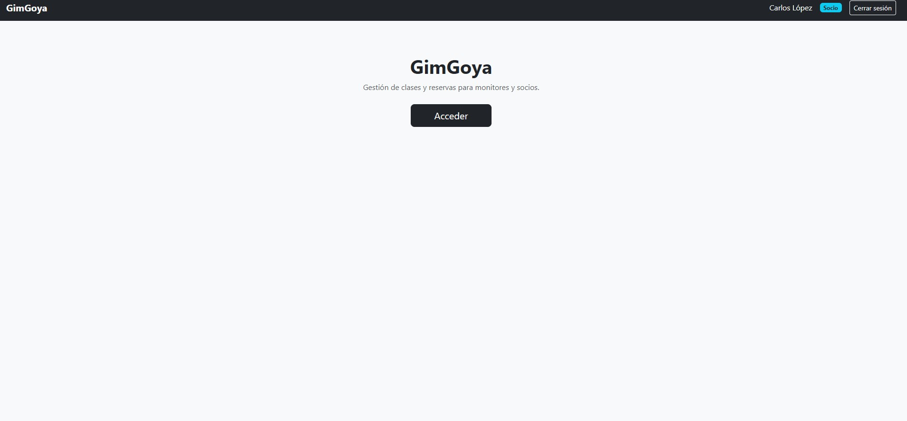
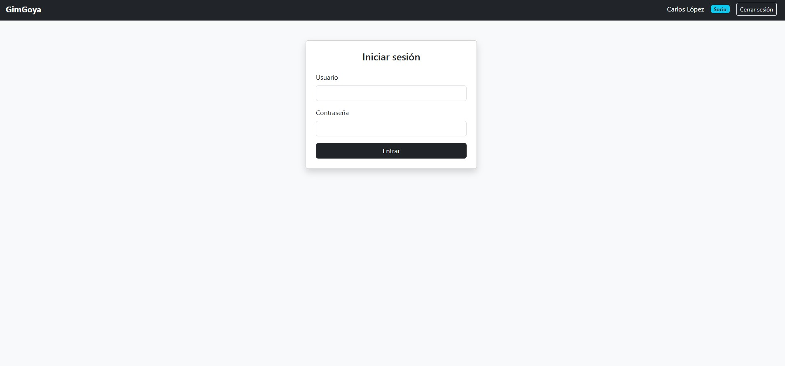
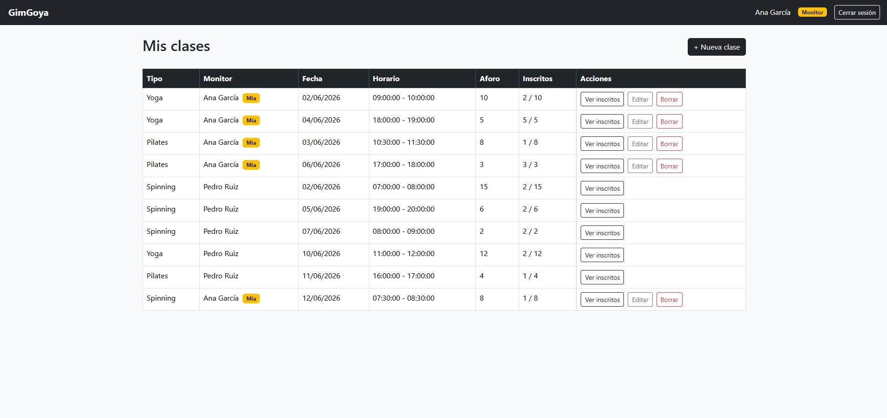
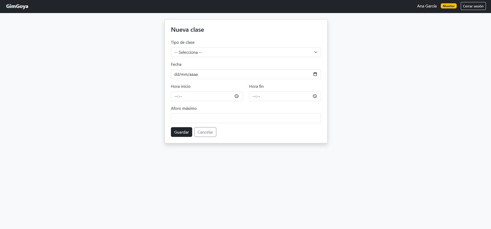
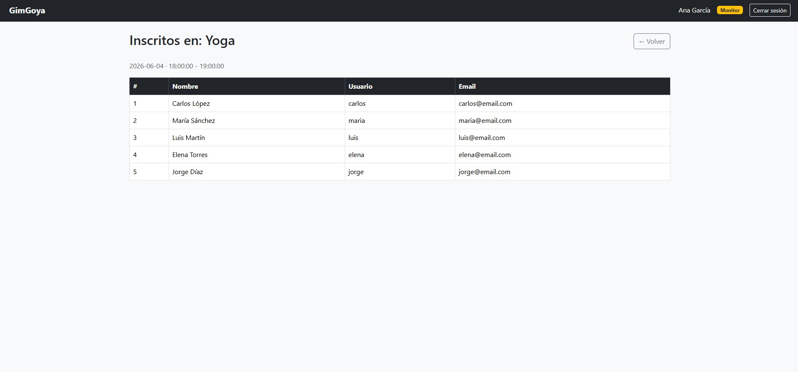
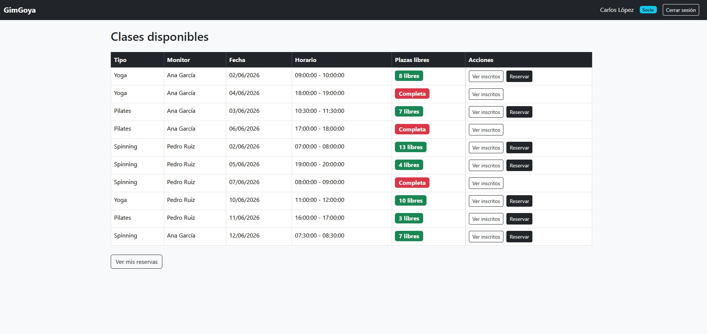
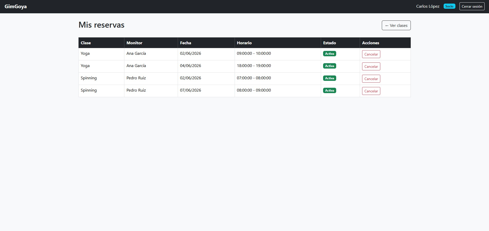
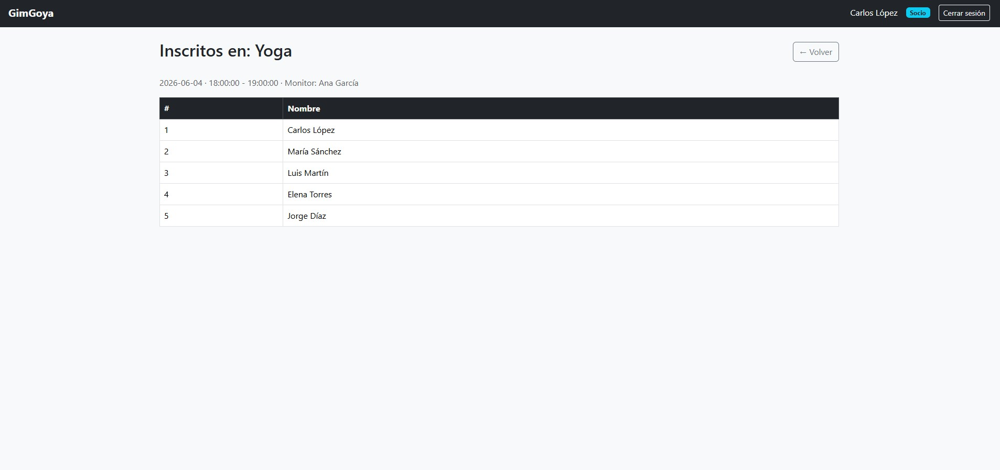
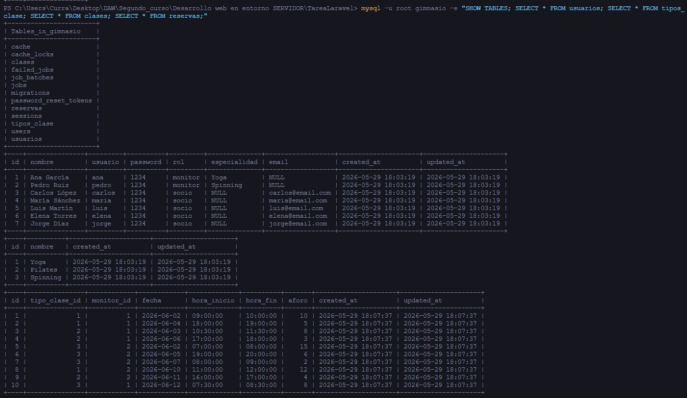

# GimGoya

Aplicación web de gestión de reservas de clases para un gimnasio, desarrollada con Laravel 13 y MySQL.

---

## Descripción

**GimGoya** es una aplicación web que permite gestionar las clases y reservas de un gimnasio. Existen dos tipos de usuario con paneles diferenciados: **monitor** y **socio**.

### Qué puede hacer un monitor

- Ver todas las clases programadas en el gimnasio, de todos los monitores
- Crear nuevas clases indicando el tipo (Yoga, Pilates, Spinning…), fecha, hora de inicio, hora de fin y aforo máximo
- Ver la lista de socios inscritos en cualquier clase
- Borrar sus propias clases; al borrarlas, se cancelan automáticamente todas las reservas asociadas

### Qué puede hacer un socio (cliente)

- Ver todas las clases disponibles (solo presentes y futuras) con información del monitor, horario y plazas libres
- Ver quién está inscrito en cada clase antes de reservar
- Reservar una plaza en una clase; el sistema valida que no esté ya reservada por ese socio y que queden plazas disponibles
- Ver sus reservas activas con todos los detalles de la clase
- Cancelar cualquiera de sus reservas activas

---

## Despliegue en producción

La aplicación está desplegada en **Railway** y accesible públicamente en:

**https://gimgoya-production.up.railway.app**

Railway es una plataforma de hosting en la nube que ejecuta la aplicación con PHP 8.3 y una base de datos MySQL independiente. Cualquier cambio publicado en la rama `main` del repositorio se despliega automáticamente.

---

## Tecnología utilizada

- **Laravel 13 / PHP 8.3** — framework MVC para el backend y generación de vistas
- **MySQL 8.4** — base de datos relacional
- **Bootstrap 5** — diseño y maquetación vía CDN
- **Blade** — motor de plantillas de Laravel para las vistas

---

## Documentación del desarrollo

### Orden de implementación

He seguido un orden de dentro hacia fuera, empezando por la capa más interna (base de datos) y terminando por la más externa (vistas). Este enfoque es el recomendado porque cada capa depende de la anterior: no tiene sentido crear vistas sin controladores, ni controladores sin modelos, ni modelos sin tablas.

### 0. Creación del proyecto

El punto de partida es generar la estructura de carpetas de Laravel con Composer:

```bash
composer create-project laravel/laravel gimnasio
```

Este comando descarga Laravel y crea automáticamente toda la estructura del proyecto:

```
gimnasio/
├── app/
│   ├── Http/
│   │   └── Controllers/    ← controladores
│   └── Models/             ← modelos Eloquent
├── database/
│   └── migrations/         ← migraciones de BD
├── resources/
│   └── views/              ← vistas Blade
├── routes/
│   └── web.php             ← definición de rutas
├── .env                    ← configuración del entorno
└── artisan                 ← herramienta de línea de comandos
```

A continuación se configuró el fichero `.env` con los datos de conexión a MySQL y se ejecutó `php artisan key:generate` para generar la clave de aplicación.

### 1. Base de datos — Migraciones

Lo primero ha sido definir la estructura de datos. He creado 4 migraciones con Artisan:

```bash
php artisan make:migration create_usuarios_table --create=usuarios
php artisan make:migration create_tipos_clase_table --create=tipos_clase
php artisan make:migration create_clases_table --create=clases
php artisan make:migration create_reservas_table --create=reservas
```

He tenido en cuenta el **orden de dependencias**: las tablas con claves foráneas deben migrarse después de las tablas a las que apuntan. `clases` referencia a `usuarios` y `tipos_clase`, por lo que su migración tiene un timestamp posterior. `reservas` referencia a `clases` y `usuarios`, por lo que va la última.

Tras definir las columnas en cada fichero, he aplicado todas las migraciones con:

```bash
php artisan migrate
```

Las 4 tablas del proyecto son:

| Tabla | Descripción |
|---|---|
| `usuarios` | Todos los usuarios del sistema con campo `rol` ('monitor' o 'socio') |
| `tipos_clase` | Catálogo de tipos: Yoga, Pilates, Spinning… |
| `clases` | Clases programadas: tipo, monitor, fecha, horario, aforo |
| `reservas` | Reservas de socios en clases: socio, clase, estado |

### 2. Modelos Eloquent

He generado los modelos con Artisan:

```bash
php artisan make:model Usuario
php artisan make:model TipoClase
php artisan make:model Clase
php artisan make:model Reserva
```

El modelo `Usuario` representa a cualquier usuario del sistema: el campo `rol` determina si es monitor o socio. `TipoClase` tiene `protected $table = 'tipos_clase'` para que Eloquent apunte al nombre correcto de la tabla. En todos los modelos se define `$fillable` y las relaciones entre ellos:

| Modelo | Relaciones |
|---|---|
| `Usuario` | `hasMany(Clase, monitor_id)` · `hasMany(Reserva, socio_id)` |
| `TipoClase` | `hasMany(Clase, tipo_clase_id)` |
| `Clase` | `belongsTo(Usuario, monitor_id)` · `belongsTo(TipoClase)` · `hasMany(Reserva)` |
| `Reserva` | `belongsTo(Usuario, socio_id)` · `belongsTo(Clase)` |

### 3. Controladores

He creado tres controladores, uno por responsabilidad:

```bash
php artisan make:controller LoginController
php artisan make:controller MonitorController
php artisan make:controller SocioController
```

- `LoginController` — formulario de login, autenticación manual con sesiones y cierre de sesión
- `MonitorController` — panel de clases, creación, edición, borrado y lista de inscritos
- `SocioController` — listado de clases disponibles, reserva con validación de aforo y duplicados, mis reservas, cancelación y ver inscritos

La autenticación es manual usando `session()->put()` y `session()->get()`, sin paquetes externos. En sesión se guardan únicamente `user_id`, `user_name` y `user_role` (no el objeto completo), de forma que un cambio en la base de datos no genera inconsistencias. La verificación de rol se hace al inicio de cada método, lo que hace explícita la lógica de acceso en el propio controlador.

### 4. Rutas

He definido todos los endpoints en `routes/web.php`. Cada ruta conecta una URL con un método de controlador:

| Método | URL | Controlador | Descripción |
|---|---|---|---|
| GET | `/` | — | Portada de la aplicación |
| GET | `/login` | `LoginController@showLoginForm` | Muestra el formulario de login |
| POST | `/login` | `LoginController@authenticate` | Procesa las credenciales y redirige según rol |
| GET | `/logout` | `LoginController@logout` | Cierra la sesión y redirige al login |
| GET | `/monitor` | `MonitorController@panel` | Panel del monitor con todas las clases |
| GET | `/monitor/clase/crear` | `MonitorController@formCrearClase` | Formulario para crear una nueva clase |
| POST | `/monitor/clase/crear` | `MonitorController@crearClase` | Guarda la nueva clase en la base de datos |
| GET | `/monitor/clase/{id}/inscritos` | `MonitorController@verInscritos` | Lista de socios inscritos en una clase |
| GET | `/monitor/clase/{id}/editar` | `MonitorController@formEditarClase` | Formulario de edición de una clase propia |
| POST | `/monitor/clase/{id}/editar` | `MonitorController@editarClase` | Guarda los cambios de la clase |
| POST | `/monitor/clase/{id}/borrar` | `MonitorController@borrarClase` | Borra la clase y cancela sus reservas |
| GET | `/socio/clases` | `SocioController@verClases` | Listado de clases disponibles para el socio |
| GET | `/socio/clase/{id}/inscritos` | `SocioController@verInscritos` | Lista de socios inscritos en una clase |
| POST | `/socio/clase/{id}/reservar` | `SocioController@reservar` | Crea una reserva validando aforo y duplicados |
| GET | `/socio/reservas` | `SocioController@misReservas` | Reservas activas del socio |
| POST | `/socio/reserva/{id}/cancelar` | `SocioController@cancelarReserva` | Cancela una reserva del socio |

### 5. Vistas Blade

Las vistas están en `resources/views/` y se crean a mano (Artisan no genera plantillas). Todas extienden el layout base con `@extends` y `@section`. Las URLs dentro de las vistas se generan siempre con el helper `route('nombre')`, sin strings hardcodeados, lo que desacopla las vistas de la estructura de rutas.

```
resources/views/
├── welcome.blade.php
├── login.blade.php
├── errors/
│   └── 404.blade.php
├── layouts/
│   └── app.blade.php
├── monitor/
│   ├── panel.blade.php
│   ├── crear_clase.blade.php
│   ├── editar_clase.blade.php
│   └── inscritos.blade.php
└── socio/
    ├── clases.blade.php
    ├── inscritos.blade.php
    └── mis_reservas.blade.php
```

**Layout base** (`layouts/app.blade.php`): Bootstrap 5 vía CDN, barra de navegación con nombre de usuario, badge de rol (amarillo para monitor, azul para socio) y botón de cerrar sesión. Los mensajes flash de éxito y error están centralizados aquí.

**Criterios de diseño aplicados en todas las tablas:**
- `table-hover` — las filas resaltan al pasar el ratón
- `table-responsive` — las tablas se adaptan a pantallas pequeñas sin desbordarse
- Fechas en formato `d/m/Y` mediante Carbon
- Filas vacías con estilo `text-muted` en lugar de texto sin formato

**Detalles adicionales por vista:**
- `monitor/panel.blade.php` — badge "Mía" en las clases propias del monitor; columna inscritos muestra `X / aforo`
- `socio/clases.blade.php` — badge de plazas muestra `X / aforo`; badge en rojo cuando la clase está completa
- `errors/404.blade.php` — página de error personalizada con el layout de la aplicación

---

## Capturas de pantalla

Las capturas están en la carpeta [`docs/capturas/`](docs/capturas/).

### Portada


<!-- CAPTURA: portada con el nombre GimGoya, descripción y botón Acceder -->

### Login


<!-- CAPTURA: pantalla de inicio de sesión con el formulario centrado -->

### Panel del monitor — listado de clases


<!-- CAPTURA: panel del monitor con la tabla de clases, columnas Tipo/Monitor/Fecha/Horario/Aforo/Inscritos/Acciones -->

### Monitor — crear clase


<!-- CAPTURA: formulario de nueva clase con los campos tipo, fecha, hora inicio/fin y aforo -->

### Monitor — inscritos en una clase


<!-- CAPTURA: tabla con los socios inscritos (nombre, usuario, email) -->

### Socio — clases disponibles


<!-- CAPTURA: tabla de clases con badge verde/rojo de plazas y botón Reservar -->

### Socio — mis reservas


<!-- CAPTURA: tabla de reservas activas del socio con botón Cancelar -->

### Socio — inscritos en una clase


<!-- CAPTURA: tabla de inscritos vista desde el rol socio (solo nombre) -->

### Base de datos



---

## Instalación

Requisitos previos: **PHP 8.3+**, **Composer**, **MySQL 8+** en ejecución.

---

**1. Obtener el proyecto**

**Opción A — Desde el zip:**
Descomprime el zip en la ubicación deseada y abre una terminal dentro de la carpeta del proyecto. El fichero `.env` ya está incluido con la configuración lista.

**Opción B — Desde Git:**
```bash
git clone https://github.com/CurraRB/gimgoya.git
cd gimgoya
```

---

**2. Instalar dependencias PHP**
```bash
composer install
```
Descarga todas las librerías definidas en `composer.json` y las coloca en `vendor/`. Esta carpeta no se incluye en el zip ni en el repositorio, por lo que este paso es obligatorio en cualquier instalación nueva.

Si la instalación falla por versión de PHP, usar:
```bash
composer install --ignore-platform-reqs
```

---

**3. Crear el fichero de entorno** ⚠️ Solo necesario si has hecho git clone

```bash
cp .env.example .env
```
En Windows sin bash:
```
copy .env.example .env
```
Abre el `.env` recién creado y ajusta los datos de conexión a MySQL:
```
DB_CONNECTION=mysql
DB_HOST=127.0.0.1
DB_PORT=3306
DB_DATABASE=gimnasio
DB_USERNAME=root
DB_PASSWORD=
```
Cambia `DB_USERNAME` y `DB_PASSWORD` si tu MySQL tiene credenciales distintas.

---

**4. Generar la clave de aplicación** ⚠️ Solo necesario si has hecho git clone

```bash
php artisan key:generate
```
Laravel necesita una clave secreta para cifrar sesiones y cookies. Este comando la genera y la escribe automáticamente en el `.env` como `APP_KEY`. Sin este paso la aplicación no arranca.

---

**5. Crear la base de datos**

Conéctate a MySQL y crea la base de datos vacía:
```bash
mysql -u root -p
```
```sql
CREATE DATABASE gimnasio;
EXIT;
```

---

**6. Opción A — Migrar y poblar con el seeder**
```bash
php artisan migrate
php artisan db:seed
```
`migrate` crea todas las tablas a partir de las migraciones del proyecto. `db:seed` inserta los datos de prueba: 2 monitores, 5 socios, 3 tipos de clase, 10 clases y 21 reservas.

**6. Opción B — Restaurar el dump incluido**

Si se prefiere restaurar directamente la base de datos con estructura y datos, abre una ventana de **símbolo del sistema (cmd)** y ejecuta:
```bash
mysql -u root gimnasio < gimnasio.sql
```
El fichero `gimnasio.sql` está en la raíz del proyecto.

---

**7. Arrancar el servidor de desarrollo**
```bash
php artisan serve
```
Lanza la aplicación en `http://localhost:8000`. Abrir esa URL en el navegador. Solo válido para desarrollo local.

---

## Reproductividad

### Entorno

```bash
php -v
# PHP 8.3.30 (cli) (built: Jan 13 2026 22:50:40)

composer -V
# Composer version 2.9.4 2026-01-22 14:08:50
```

```
php artisan about --only=environment

  Environment
  Application Name ..... GimGoya
  Laravel Version ...... 13.12.0
  PHP Version .......... 8.3.30
  Composer Version ..... 2.9.4
  Environment .......... local
  Debug Mode ........... ENABLED
  URL .................. localhost
  Maintenance Mode ..... OFF
  Timezone ............. UTC
  Locale ............... en
```

### Base de datos

El fichero `gimnasio.sql` incluido en el repositorio y en el zip contiene toda la estructura y los datos de prueba. Para restaurarlo, abre una ventana de **símbolo del sistema (cmd)** y ejecuta:

```bash
mysql -u root -e "CREATE DATABASE gimnasio;"
mysql -u root gimnasio < gimnasio.sql
```

Para generar un nuevo dump, desde **cmd**:

```bash
mysqldump -u root gimnasio > gimnasio.sql
```

### Comandos Artisan ejecutados durante el desarrollo

```bash
# Proyecto
composer create-project laravel/laravel gimnasio

# Migraciones
php artisan make:migration create_usuarios_table --create=usuarios
php artisan make:migration create_tipos_clase_table --create=tipos_clase
php artisan make:migration create_clases_table --create=clases
php artisan make:migration create_reservas_table --create=reservas
php artisan migrate

# Modelos
php artisan make:model Usuario
php artisan make:model TipoClase
php artisan make:model Clase
php artisan make:model Reserva

# Controladores
php artisan make:controller LoginController
php artisan make:controller MonitorController
php artisan make:controller SocioController

# Datos de prueba
php artisan db:seed
```

---

## Usuarios de prueba

### Monitores

| Nombre       | Usuario | Contraseña | Especialidad |
|--------------|---------|------------|--------------|
| Ana García   | ana     | 1234       | Yoga         |
| Pedro Ruiz   | pedro   | 1234       | Spinning     |

### Socios

| Nombre          | Usuario | Contraseña |
|-----------------|---------|------------|
| Carlos López    | carlos  | 1234       |
| María Sánchez   | maria   | 1234       |
| Luis Martín     | luis    | 1234       |
| Elena Torres    | elena   | 1234       |
| Jorge Díaz      | jorge   | 1234       |
